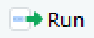

```{r setup, include=FALSE}
knitr::opts_chunk$set(echo = TRUE, 
                      message = FALSE,	
                      warning = FALSE,
                      fig.width = 4, 
                      fig.height = 4, 
                      fig.retina = 3)
options(htmltools.dir.version = FALSE)
```

```{r packages, include=FALSE}
library(RefManageR)
library(kableExtra)
library(tidyverse)
```


```{r, load-refs, include=FALSE, cache=FALSE}
BibOptions(check.entries = FALSE,
           bib.style = "authoryear",
           cite.style = "authoryear",
           style = "markdown",
           hyperlink = TRUE,
           dashed = FALSE,
           longnamesfirst = FALSE,
           max.names = 2)
myBib <- ReadBib("refs.bib", check = FALSE)
```

class: inverse

#  Introduction
---

background-image: url(pics/RStudio-Logo-Flat.png)
background-position: 10% 90%
background-size: 200px
# What this training is and is not

.pull-left[

Is an introduction to
* R for those that have no experience
* data import, tidying, analysis and  presentation 
* some universal and highly transferable concepts 
* the skills for organising reproducible analyses  

]

--

.pull-right[

It is not
* An introduction to statistics  
* Magic  

]

---
# Overview

Introduction
* Rationale for scripting  
* Why R?  
* Organisation of data and analyses 

--

Introduction to R
* Finding your way round RStudio  
* Typing in data, doing some calculations on it, plotting it  
* Understanding the manual  
* Importing data: working directories and paths  
* Summarising and visualising data  

---
background-image: url(pics/rationale1.png)
background-position: 50% 55%
background-size: 800px

# Rationale for scripting analysis
.pull-left[
Generating the results
]

.pull-right[
Analysing and  
reporting them
]

---
background-image: url(pics/rationale2.png)
background-position: 50% 55%
background-size: 800px

# Rationale for scripting analysis

---
background-image: url(pics/rationale3.png)
background-position: 50% 55%
background-size: 800px

# Rationale for scripting analysis

---
background-image: url(pics/rationale5.png)
background-position: 10% 35%
background-size: 900px

# Rationale for scripting analysis

---
# Why R?

## Open source and free

--

.......But so is Python
  
--

R caters to users who do not see themselves as programmers, but then allows them to slide gradually into programming  


--

R was designed for data analysis and graphics  

---
background-image: url(pics/welcome_to_rstats_twitter.png)
background-position: 95% 70%
background-size: 350px
# Why R?

## Community

The R community is one of R's greatest assets, being vibrant, inclusive and supportive of users at all levels.

[#rstats](https://twitter.com/hashtag/rstats?lang=en)  
[RForwards](https://forwards.github.io/)  
[RLadies](https://rladies.org/)  
[Hey! You there! You are welcome here](https://ropensci.org/blog/2017/06/23/community/)  

.footnote[
.font60[
Artwork by @allison_horst "welcome to rstats on twitter"
]
]


---
background-image: url(pics/rmarkdown_wizards.png)
background-position: 10% 55%
background-size: 400px
# Why R?

## R Markdown  

R's "killer feature"  .......Super-charged reproducibility!

.footnote[
.font60[
Artwork by @allison_horst "Be an Rmarkdown knitting wizard."
]
]

---
# Summary

* The course is:
  * an introduction to reproducible analyses rather than statistics  
  * not enough, you need to practice!  
* Scripting makes your work reproducible  
* Focus is on R but principles are widely applicable  

---
class: inverse

#  Introduction to R
---

background-image: url(pics/tidyverse_logo.png)
background-position: 100% 80%
background-size: 180px

# Overview

* Finding your way round RStudio  
* Typing in data, doing some calculations on it, plotting it
* Understanding the manual  
* Working with imported data  
  * Importing data: working directories and paths  
  * Summarising and visualising with the [`tidyverse`](https://www.tidyverse.org/)  

---

class: inverse

#  Finding your way round RStudio
---

# RStudio: live demonstration

Overview [Larger](http://www-users.york.ac.uk/~er13/RStudio%20Anatomy.svg). **Will be followed be a recap**

```{r, echo=FALSE, out.width = "600px"}
knitr::include_graphics("http://www-users.york.ac.uk/~er13/RStudio%20Anatomy.svg")
```


There is an [RStudio cheatsheet](http://www-users.york.ac.uk/~er13/rstudio-ide.pdf) which covers more advanced RStudio features.

---
# RStudio: Recap

* the panels
* making yourself comfortable
* typing in the console sending commands
* using R as a calculator
* assigning values
* where to see objects
* using a script - make sure to execute
* comments \#
* data types and structures
* functions `c()`, `class()` and `str()`
* types of R files: .R, .RData .RHistory


---
# RStudio: Recap

.pull-left[
Top left Panel
* Script - write and edit code and comments to keep  
 
---
Bottom left Panel 
* Console - where commands get executed and can be typed  
]

.pull-right[
Top right Panel
* Environment - see your objects  
* History - of commands  
--- 
Bottom right Panel
* Files - a file explorer  
* Packages - those installed and a method of installing  
* Help - the manual  
* Plots
]

---
# RStudio: Recap
Type of file
* .R 
  a script file: code and comments
* .RData: a environment file also known as a workspace. Objects but no code
* .RHistory: everything you typed, mostly wrong!
 
Using a script 
* any R code can be executed from a script
* code can be (should be!) commented  
* comments start with a `#`

---
# RStudio: Recap
Data types and structures
These are the most commonly needed but there are others
.pull-left[
Types
* numeric
* integer
* logical
* character
]
.pull-right[
Structures
* vectors
* factors
* dataframes
]

---

class: inverse

# Typing in data, doing some calculations on it, plotting it

---
# Typing in data, calcs, plots

## The goal
We will work some data on the number of males in 64 bird nests with a clutch size of 5. You are going to type data in R, summarise and plot it
--
.pull-left[

```{r , echo=FALSE}
n <- c(0, 1, 2, 3, 4, 5)
freq <- c(4, 13, 14, 15, 13, 5)
df <- data.frame(n, freq)
knitr::kable(df, 
             format = "html",
             col.names = c("No. males", "No. nests"),
             row.names = FALSE)%>%
  kable_styling(font_size = 16)
```
]
.pull-right[

```{r , echo=FALSE, fig.height=3}
nest_data <- data.frame(n = factor(n), freq)
ggplot(data = nest_data, aes(x = n, y = freq)) +
  geom_col(colour = "black", fill = "white", width = 1) +
  scale_x_discrete(name = "Number of males",
                   expand = c(0, 0)) +
  scale_y_continuous(name = "Number of nests",
                     expand = c(0, 0)) +
  theme_classic()
```
]


---
# Typing in data, calcs, plots

## Getting set up

In RStudio do File | New project | New directory

Be purposeful about where you create it and name it.

I suggest `birds`

--

Make a new script  and save it as analysis.R to carry out the rest of the work.  


---
# Typing in data, calcs, plots

## Data structures

Make a vector `n` that holds the numbers 0 to 5. 
```{r}
# the number of males in a clutch of five
n <- c(0, 1, 2, 3, 4, 5)
```

* Write your command in the analysis.R  

--

* Notice I have used a comment  
--

* Cursor on the line you want to execute  

--

* Execute with  or Ctrl+Enter 

---
# Typing in data, calcs, plots

## Data structures

Let's take a look at it using `str()` (structure) and `class()`
--
```{r}
class(n)
```
--
```{r}
str(n)
```

It's a numeric vector.
 


---
# Typing in data, calcs, plots

## Data structures

Create a vector, `freq`, containing the numbers of nests with 0 to 5 males. 

```{r}
# the number of nests with 0 to 5 males
freq <- c(4, 13, 14, 15, 13, 5)
```
---
# Typing in data, calcs, plots

## Total number of nests

We can use `sum(freq)` to check the total number of nests is 64.

```{r}
# the total number of nests
sum(freq)
```

---
# Typing in data, calcs, plots

## Finding the mean
We have frequencies so to find the mean number of males per nest we need the total number of males:
.pull-left[
```{r , echo=FALSE}
df$product <- df$n * df$freq
totalm <- sum(df$product)
totaln <- sum(df$freq)
dfchar <- df %>%
  mutate_all(as.character)
dfchar <- rbind(dfchar, c("Total", totaln, totalm))
dfchar %>% kable(format = "html",
                 col.names = c("No. males", "No. nests", "No. males *No. nests"),
                 row.names = FALSE) %>% 
  kable_styling(font_size = 16) %>%
  row_spec(6, hline_after = TRUE) %>%
  row_spec(7, bold = TRUE, background = "#C0C2C9")
```
]

.pull-right[

$$\frac{163}{64} = 2.55$$
]

---
# Typing in data, calcs, plots

## Finding the mean
Total number of nests:
```{r}
total_nests <- sum(freq)
```
 
--
Total number of males
```{r}
total_males <- sum(n * freq)
```

---
# Typing in data, calcs, plots

## Finding the mean
Mean number of males per nest:
```{r}
total_males/total_nests
```


---
# Why it works

R works 'elementwise' unlike most programming lanaguges.  
` n * freq`
gives

$$\begin{bmatrix}0\\1\\2\\3\\4\\5\end{bmatrix}\times\begin{bmatrix}4\\13\\14\\15\\13\\5\end{bmatrix}=\begin{bmatrix}0\\13\\28\\45\\52\\25\end{bmatrix}$$

It was designed to make it easy to work with data.

---

class: inverse

# Plotting the data with ggplot()

---
background-image: url(pics/ggplot2.png)
background-position: 90% 75%
background-size: 200px

# Typing in data, calcs, plots

Commands like `c()`, `sum()`, and `str()` are part the 'base' R system.

Base packages (collections of commands) always come with R. 

--

Other packages, such as `ggplot2` `r Cite(myBib, "ggplot2")` need to be added.

`ggplot2` is one of the `tidyverse` `r Cite(myBib, "tidyverse")` packages.

---
background-image: url(pics/tidyverse.png)
background-position: 90% 75%
background-size: 200px
# Typing in data, calcs, plots

You should have already installed `tidyverse` but we need to load it (add it to our library) before we can use it in a session.

```{r eval=FALSE}
library(tidyverse)
```

--

We will also later use `dplyr` and `tidyr` functions also from `tidyverse`.

--

`ggplot2` is the name of the package

`ggplot()` is its most important command


---
# Plotting using ggplot2

## Data structure for `ggplot()` 

`ggplot()` takes a dataframe for an argument

We can make a dataframe of the two vectors, `n` and `freq`: 
```{r}
nest_data <- data.frame(n = factor(n), freq)
```

`n` was made into a factor (a categorical variable).

---
# Plotting using ggplot2

## Data structure for `ggplot()` 
Check:
```{r}
str(nest_data)
```

--

`nest_data` is the name we have given the dataframe

Click on `nest_data` in the Environment. 

---
# Plotting using ggplot2

## A barplot

Create a simple barplot using `ggplot` like this:

```{r, fig.height=3.5}
ggplot(data = nest_data, aes(x = n, y = freq)) +
  geom_col()

```


---
# Plotting using ggplot2

## A barplot

`ggplot()` alone creates a blank plot. 

--

`ggplot(data = nest_data)` looks the same. 

--

`aes()` gives the 'Aesthetic mappings'. How variables (columns) are mapped to visual properties (aesthetics) e.g., axes, colour, shapes.

Thus...
---
# Plotting using ggplot2

## A barplot

`ggplot(data = nest_data, aes(x = n, y = freq))` produces a plot with axes 

--

`geom_col` A 'Geom' (Geometric object) gives the visual representations of the data: points, lines, bars, boxplots etc.

---

class: inverse

# Using the help manual

---
# Using the help manual

'Arguments' can be added to the `geom_col()` command.  

Commands do something 

Their arguments go in brackets and can specify:
* what object to do it to  
* how exactly to do it  

--

Many commands have defaults so you need only supply an object.

---
# Using the help manual

Open the manual page using:
```{r eval=FALSE}
?geom_col()
```

## Demonstration
---
# Using the help manual: Recap

* **Description** an overview of what the command does  
* **Usage** lists argument    
  * form: argument name = default value  
  * some arguments MUST be supplied others have defaults
  * ... means etc
* **Arguments** gives the detail about the arguments 
* **Details** describes how the command works in more detail  
* **Value** gives the output of the command 
* Don't be too perturbed by not fully understanding the information

---
# Using manual: Alter a ggplot

Change the fill of the bars using `fill`:
```{r plot-last1, fig.show = 'hide'}
ggplot(data = nest_data, aes(x = n, y = freq)) +
  geom_col(fill = "lightblue")

```
.pull-left[
```{r ref.label = 'plot-last1', echo = FALSE, fig.height=3.5}
```
]
--
.pull-right[
Colours can be given by their name, "lightblue" or code, "#ADD8E6".  

Look up by [name](pics/colournames.pdf) or [code](pics/colourhex.pdf)

]

---
# Using manual: Alter a ggplot

`fill` is an aesthetic. 

We can set (map) fill aesthetic to a particular colour inside `geom_col()` or map it to a variable inside the `aes()` instead
---
# Using manual: Alter a ggplot
```{r plot-last2, fig.show = 'hide'}
ggplot(data = nest_data, aes(x = n, y = freq, fill = n)) +
  geom_col()

```
.pull-left[
```{r ref.label = 'plot-last2', echo = FALSE, fig.height=3.5}

```
]
--
.pull-right[

Mapping fill to variable means the colour varies for each value of n. 
]
---
# Using manual: Alter a ggplot

Can you use the manual to put the bars next to each other?

.footnote[
<br>
`r text_spec("Extra exercise:", background = "#25496b", color = "#f6fafd", bold = TRUE)`  Change the colour of the lines around each bar to black.]
--

```{r fig.height=2.8}
ggplot(data = nest_data, aes(x = n, y = freq)) +
  geom_col(fill = "lightblue", width = 1)
```


---
# Using manual: Alter a ggplot

`r text_spec("Extra exercise:", background = "#25496b", color = "#f6fafd", bold = TRUE)`  Change the colour of the lines around each bar to black.

.pull-left[
```{r plot-last3, fig.show="hide"}
ggplot(data = nest_data,
       aes(x = n, y = freq)) +
  geom_col(fill = "lightblue", 
           width = 1, 
           colour = "black")
```
]

.pull-right[
```{r ref.label = 'plot-last3', echo = FALSE}
```
]
---
# Top Tip

<style>
div.blue { background-color:#b0cdef; border-radius: 5px; padding: 20px;}
div.grey { background-color:#d3d3d3; border-radius: 0px; padding: 0px;}
</style>

<div class = "blue">
.font100[
Make your code easier to read by using white space and new lines  

* put spaces around `=` , `->` and after `,`  
* use a newline after every comma in a command with lots of arguments ] 
</div>

---
# Alter a ggplot: axes 
Changes to a discrete x axis: `scale_x_discrete()`.

Changes to a continuous y axis: `scale_y_continuous()`.

`ggplot` automatically extends the axes slightly. You can turn this behaviour off with the expand argument.

--

Each 'layer' is added to the ggplot() command with a `+`

---
# Alter a ggplot: axes

```{r fig.height=3.5}
ggplot(data = nest_data, aes(x = n, y = freq)) +
  geom_col(fill = "lightblue", 
           width = 1, 
           colour = "black") +
  scale_x_discrete(expand = c(0, 0)) + #<<
  scale_y_continuous(expand = c(0, 0)) #<<
```

.pull-right[
.footnote[
`r text_spec("Extra exercise:", background = "#25496b", color = "#fdf9f6", bold = TRUE)`  Look up `scale_x_discrete` in the manual and work out how to change "n" to "Number of Males"]
]

---
# Alter a ggplot: axes

```{r fig.height=2.5}
ggplot(data = nest_data, aes(x = n, y = freq)) +
  geom_col(fill = "lightblue", 
           width = 1, 
           colour = "black") +
  scale_x_discrete(expand = c(0, 0),
                   name = "Number of Males") + #<<
  scale_y_continuous(expand = c(0, 0),
                     name = "Number of Nests") 

```

---

class: inverse

# Working with imported data


---
# The goal
.pull-left[
Summarise
```{r echo=FALSE}
pigeon <- read.table("data/pigeon.txt", header = T)
pigeon2 <- pivot_longer(data = pigeon,
                        cols = everything(), 
                        names_to = "population",
                        values_to = "distance")
sumpig <- pigeon2 %>%
  group_by(population) %>% 
  summarise(n = length(distance),
            mean = mean(distance),
            se = sd(distance)/sqrt(n))
sumpig %>% 
    kable(format = "html",
          digits = 2,
                 col.names = c("Population",
                               "N", 
                               "Mean",
                               "SE"),
                 row.names = FALSE) %>%
  add_header_above(c(" " = 2, " Interorbital distance" = 2)) %>%
  kable_styling(font_size = 16)

```
]
.pull-right[
Plot

```{r echo=FALSE}
ggplot(data = pigeon2, aes(x = distance, fill = population))  +
  geom_density(col = "black", alpha = 0.3) +
   scale_x_continuous(expand = c(0, 0),
                   name = "Interorbital distance (mm)") +
  scale_y_continuous(expand = c(0, 0),
                     name = "Density") +
  theme_classic()
```
]
---
background-image: url(pics/interorbital.png)
background-position: 100% 0%
background-size: 180px

# Working with Data 
 
## Importing

This section will teach you about three concepts:

--

1. 'working directories', 'paths' and  'relative paths' 

--

2. Tidy data

--

3. dealing with data in more than group  

--

We will work with the interorbital distances of domestic pigeons in two different populations: A and B

---
# Working with Data 
## Importing

It is good practice to organise your files into a folder structure. 

For example, I often use:

---
# Example organisation

.pull-left[
Directories
* systematic  
* repeatable  

Naming: human and machine readable
  * no spaces  
  * use snake/kebab case  
  * ordering: numbers (zero left padded), dates  
  * file extensions
]
.pull-right[
.code40[
```
-- stem_cell_rna_2019
   |__stem_cell_rna_2019.Rproj
   |__raw_ data
      |__2019-03-21_donor_1.csv
      |__2019-03-21_donor_2.csv
      |__2019-03-21_donor_3.csv
   |__processed_data
      |__all_long.txt
      |__all_wide.txt
   |__figures
      |__01_volcano_donor_1_vs_donor_2.eps
      |__02_volcano_donor_1_vs_donor_3.eps
   |__functions
      |__01_file_import
      |__02_normalise.R
      |__theme_pca.R
      |__theme_volcano.R
   |__pics
      |__01_image.png
      |__01_image.png
   |__README.md
   |__refs
      |__r_refs.bib
      |__proj_refs.bib
   |__analyses
      |__01_data_processing.R
      |__02_exploratory.R
      |__03_modelling.R
      |__04_figures.R
      |__05_report.Rmd
```
]

]

---
# Working with Data 
## Organising
<br>
Make two folders in your Project directory (this is also your working directory) called 'data'

The easiest way to do this is in RStudio  - see the bottom right Files panel

--

Save a copy of [pigeon.txt](data/pigeon.txt) to the 'data' folder

--

Make a new script called 'analysis.R'

---
# Working with Data 
## Importing


To read the data in to R you need to use the 'relative path'

to the file in the `read.table()` command:


```{r eval=FALSE}
pigeon <- read.table("data/pigeon.txt", 
                     header = TRUE)
```

```{r echo=FALSE}
pigeon <- read.table("data/pigeon.txt", 
                     header = TRUE)
```
--

The `data/` part is the 'relative path' to the file. 

---

class: inverse

#  What is a path?


---
# What is a path?

A path gives the location of a filesystem object (i.e., a file, directory or link).

A path can be **absolute** or **relative**

--

An **absolute path** gives the location from the root directory of the object. 

A **relative path** gives the location relative to the working directory.
---
# What is a path?
## Absolute paths
For example the absolute path for a file, `pigeon.txt` can be:  
  * windows: `M:/web/58M_BDS_2019/data/pigeon.txt`  <sup>1</sup>
.footnote[
.font70[
1. this appears as `M:\web\58M_BDS_2019\data\pigeon.txt` in Windows Explorer because Microsoft DOS didn't have directories in 1981 when it was released. It then used the `/` character for 'switches' (instead of the unix convention `-`)]
]
--

  * unix systems: `/users/er13/web/58M_BDS_2019/data/pigeon.txt`  
--

  * web: `http://www-users.york.ac.uk/~er13/58M_BDS_2019/data/pigeon.txt`  
---
# What is a path?

## Relative paths

A working directory is where a program thinks you are and is returned by `getwd()` in R.

--

For example when `pigeon.txt` is in:  
  * the working directory (wd):  `pigeon.txt`  
--

  * a directory called 'data' which is in the wd: `data/pigeon.txt`  
--

  * the directory above the wd: `pigeon.txt`  
--

  * a directory called 'data' which is in the directory above the wd: `data/pigeon.txt`  

---
# Working with Data 
## Importing

Look at the structure of the dataframe pigeon using `str()`

```{r }
str(pigeon)
```
--

It's a dataframe with two variables (columns) called A and B

The datatype of both variables is numeric.
---
# Working with Data

## Understanding the dataframe
A dataframe is made of columns and rows

The columns are the variables; the rows are the observations

--

To refer a column inside a dataframe (a single column data) we need to use the dollar notation: `dataframe$columnname`
---
# Working with Data

## Understanding the dataframe

So to output all of the values of one column we can use:
.scroll-output-width[
```{r}
pigeon$A
```
]
---
# Working with Data

## Summarising multi-group data

Thus to find the mean of a single column data: 

.pull-left[

```{r }
mean(pigeon$A)
```


```{r }
mean(pigeon$B)
```
]
.pull-right[

This relies on the groups being in different columns!

]
---
# Working with Data 

## Tidy format


Instead of having a population in each column, we often have, **and want**, all measurements in one column with a second column giving the group. 

--

This format is described as 'tidy' `r Cite(myBib, "Wickham2019-ml")`.


--

Has one variable in each column and only one observation (case) per row.

--

Captures the structure of data and allows you to specify the role of variables in analyses and visualisations.
---
# Data Organisation

## What is tidy data?

One response per row.

Tidy data adhere to a consistent structure which makes it easier to manipulate, model and visualize them. The structure is defined by:  

1. Each variable has its own column.  
2. Each observation has its own row.  
3. Each value has its own cell.  

---
# Data Organisation

## What is tidy data?

The term 'tidy data' was popularised by `r Citet(myBib, "Wickham2014-nl")`.

Closely allied to the relational algebra of relational databases `r Cite(myBib, "Codd1990-th")`. Underlies the enforced rectangular formatting in SPSS, STATA and R's dataframe.  

--

There may be more than one potential tidy structure.  


---
# Working with Data 

```{r echo=FALSE}
pigeon <- read.table("data/pigeon.txt", header = T)
```

## Tidy format

Suppose we had just 3 individuals in each of two populations:

.pull-left[
NOT TIDY!
```{r echo=FALSE}
knitr::kable(pigeon[1:3,], 
             format = "html") %>%
  kable_styling(font_size = 16)
```
]
```{r echo=FALSE}
pigeon2 <- gather(data = pigeon, 
                  key = population, 
                  value = distance)
```

.pull-right[

TIDY!
```{r echo=FALSE}
knitr::kable(head(pigeon2[c(1:3,41:43),]), 
             format = "html",
             row.names = FALSE) %>%
  kable_styling(font_size = 16)
```
]


---
# Working with Data 
We can make the data tidy with `pivot_longer()`<sup>1</sup>.

.footnote[
[1] `pivot_longer()` is a function from a package called `tidyr` which is one of the `tidyverse` packages.
]
--

`pivot_longer()` collects the values from specified columns (`cols`) into a single column (`values_to`) and creates a column to indicate the group (`names_to`). 

---
# Working with Data 
.scroll-output-width[
```{r}

pigeon2 <- pivot_longer(data = pigeon, 
                        cols = everything(), 
                        names_to = "population", 
                        values_to = "distance")
str(pigeon2)
```
]

A 'tibble' $\approx$ dataframe

---
# Working with Data 

Now we have a dataframe in tidy format which *will* make it easier to summarise, analyse and visualise.

--

To summarise data in this format we use the `group_by()` and `summarise()` functions.

--

We will also use the pipe operator: ` %>% `

---
# Working with Data 

To summarise multiple group data in tidy form:

```{r eval=FALSE}
pigeon2 %>% 
  group_by(population) %>% 
  summarise(mean = mean(distance))
```

--

This can be read as:
  - take pigeon2 *and then*  
  - group it by population *and then*  
  - summarise it by calculating the mean  

i.e., the mean is done for each population.

--

The `mean` before the `=` is just a name.

---
# Working with Data 
The result:

```{r echo=FALSE}
pigeon2 %>% 
  group_by(population) %>% 
  summarise(mean = mean(distance))
```
---
# Working with Data 

We can add the number of pigeons in each group to the summary using the `length()` function.

```{r eval=FALSE}
pigeon2 %>% 
  group_by(population) %>% 
  summarise(mean = mean(distance),
            n = length(distance)) #<<
```

.footnote[
`r text_spec("Extra exercise:", background = "#25496b", color = "#fdf9f6", bold = TRUE)`  Add a column for the standard deviation

`r text_spec("Extra exercise:", background = "#25496b", color = "#fdf9f6", bold = TRUE)`  Add a column for the standard error given by $\frac{s.d.}{\sqrt{n}}$

]
---
# Working with Data 

The result:

```{r echo=FALSE}
pigeon2 %>% 
  group_by(population) %>% 
  summarise(mean = mean(distance),
            n = length(distance)) #<<
```


---
# Working with Data 

```{r}
pigeon2 %>% 
  group_by(population) %>% 
  summarise(mean = mean(distance),
            n = length(distance),
            sd = sd(distance), #<<
            se = sd/sqrt(n))   #<<
```

---
# Working with Data 
To plot this data as a histogram:

```{r plot-last4, fig.show = 'hide'}
ggplot(data = pigeon2, aes(x = distance)) +
  geom_histogram(bins = 10,               #<<
                 col = "black") +
  scale_x_continuous(name = "Interorbital distance (mm)")
  
```
.pull-left[

```{r ref.label = 'plot-last4', echo = FALSE, fig.height=3}
```
]

--
.pull-right[

`geom_histogram()` is the `geom` and `bins` gives the number of bars.

This is whole data set, not separated by population!

]

---
# Working with Data 

To plot multiple group data in tidy form we map the population variable to the `fill` aesthetic

```{r fig.height=3}
ggplot(data = pigeon2, aes(x = distance, fill = population)) + #<<
  geom_histogram(bins = 10, 
                 col = "black") +
  scale_x_continuous(name = "Interorbital distance (mm)")
  
```
.pull-right[
.footnote[
`r text_spec("Extra exercise:", background = "#25496b", color = "#fdf9f6", bold = TRUE)`  Make the axes cross at (0,0)]
]
---
# Working with Data 

`r text_spec("Extra exercise:", background = "#25496b", color = "#fdf9f6", bold = TRUE)`  Make the axes cross at (0,0)

```{r plot-last5, fig.show = 'hide'}
ggplot(data = pigeon2, aes(x = distance, fill = population)) + 
  geom_histogram(bins = 10, 
                 col = "black") +
  scale_x_continuous(name = "Interorbital distance (mm)",
                     expand = c(0, 0)) + #<<
  scale_y_continuous(name = "Frequency",
                     expand = c(0, 0)) #<<
  
  
```
result on next slide.
---
# Working with Data 
The result:

```{r ref.label = 'plot-last5', echo = FALSE} 
```

---
# Working with Data 

`geom_density()` can also be used when `distance` is mapped to `x` and  `y` gives a measure of occurrence.

```{r fig.height=3}
ggplot(data = pigeon2, aes(x = distance, fill = population)) +
  geom_density(col = "black") +               #<<
  scale_x_continuous(name = "Interorbital distance (mm)")
  
```

---
# Working with Data 

Alter the transparency using `alpha`:

```{r fig.height=3}
ggplot(data = pigeon2, aes(x = distance, fill = population)) +
  geom_density(col = "black", alpha = 0.3) +    #<<
  scale_x_continuous(name = "Interorbital distance (mm)")
  
```

---
# Working with Data 

Formatting figures for inclusion in reports?

All [elements can be customised individually](https://ggplot2.tidyverse.org/reference/theme.html) but `theme_classic()` takes care of many options you are likely to desire.

---
# Working with Data 

```{r fig.height=3}
ggplot(data = pigeon2, aes(x = distance, fill = population)) +
  geom_density(col = "black", alpha = 0.3) +
  scale_x_continuous(name = "Interorbital distance (mm)") +
  theme_classic()    #<<
  
```

---
# Working with Data 

A different kind of plot:

.pull-left[
```{r echo=FALSE} 
ggplot(data = pigeon2, aes(x = population, y = distance)) + 
  geom_boxplot() +                            
  scale_x_discrete(name = "Population") +
  scale_y_continuous(name = "Interorbital distance (mm)",
                   expand = c(0, 0),
                   limits = c(0, 15)) +
  theme_classic()
  
```
]

.pull-right[

Note: We need to change the `aes()` as well as the `geom` because this figure has population on the x axis.

]
---
# Working with Data 

```{r plot-last6, fig.show = 'hide'} 
ggplot(data = pigeon2, aes(x = population, y = distance)) + 
  geom_boxplot() +                            
  scale_x_discrete(name = "Population") +
  scale_y_continuous(name = "Interorbital distance (mm)",
                   expand = c(0, 0),
                   limits = c(0, 15)) +
  theme_classic()
  
```


.footnote[
`r text_spec("Extra exercise:", background = "#25496b", color = "#fdf9f6", bold = TRUE)`  Can you (gratuitously) colour the boxes by population too?
]
---
# Working with Data 

```{r ref.label = 'plot-last6', echo = FALSE} 
```
---
# Summary
* Use a script and comment it  
* organise analyses and use relative paths
* shortcuts: `<-` is Alt-minus  ` %>%` is Ctl-Shift-M  
* objects are seen in the Environment window  
* data is read in to R from files into dataframes  
* the dataframe is a common data structure  
* you'll eventually get used to the manual!  
* a `ggplot` has a `data` argument and an `aesthetic` argument; layers are added with a `+`; `geoms`determine how the data are plotted  
---

class: inverse

# `r emo::ji("party")` Congratulations! Keep practising! `r emo::ji("party")` 

.footnote[
Slides made with with xaringan `r Cite(myBib, "xaringan")`

]

---
# Organisation of analyses

## Further Reading

* "Ten simple rules for reproducible computational research" `r Cite(myBib, "Sandve2013-nd")`  
* "Best practices for scientific computing" `r Cite(myBib, "Wilson2014-ij")`  
* "Good enough practices in scientific computing" `r Cite(myBib, "Wilson2017-cp")`  
* "Excuse Me, Do You Have a Moment to Talk About Version Control?" `r Cite(myBib, "Bryan2018-hl")`  


---
# References
.font60[
```{r refs, echo=FALSE, results="asis"}
PrintBibliography(myBib)  
```
]
---
# Reproducibility in R

Emma Rand [emma.rand@york.ac.uk](mailto:emma.rand@york.ac.uk)  
Twitter: [@er13_r](https://twitter.com/er13_r)  
GitHub: [3mmaRand](https://github.com/3mmaRand)  
blog: https://buzzrbeeline.blog/  
<br>
<a rel="license" href="http://creativecommons.org/licenses/by-nc-sa/4.0/"></a><br /><span xmlns:dct="http://purl.org/dc/terms/" property="dct:title">Royal Society of Biology Online: An Introduction to Reproducible Analyses in R</span> by <span xmlns:cc="http://creativecommons.org/ns#" property="cc:attributionName">Emma Rand</span> is licensed under a <a rel="license" href="http://creativecommons.org/licenses/by-nc-sa/4.0/">Creative Commons Attribution-NonCommercial-ShareAlike 4.0 International License</a>.


